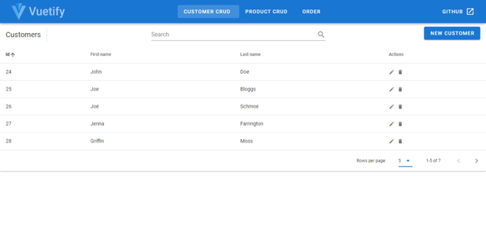
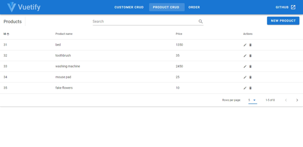
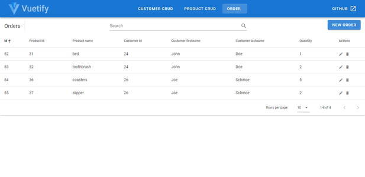
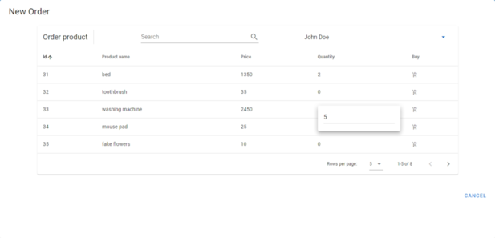

# CRUD-API

A demo API for creating, retrieving, updating and deleting customer, product and order entities.

## Run Locally

Clone the project

```bash
  git clone https://github.com/ysfada/CRUD-API.git
```

Start the API

```bash
  cd ./CRUD-API/src
  dotnet run --project Api
```

API runs at [http://localhost:5000/swagger](http://localhost:5000/swagger)

Install frontend dependencies and serve

```bash
  cd ./CRUD-API/src/Frontend
  npm install
  npm run serve
```

Frontend runs at [http://localhost:8080](http://localhost:8080)

## API Reference

### Customer

```http
  GET /api/customer
  POST /api/customer
  GET /api/customer/${id}
  PUT /api/customer/${id}
  DELETE /api/customer/${id}
```

### Product

```http
  GET /api/product
  POST /api/product
  GET /api/product/${id}
  PUT /api/product/${id}
  DELETE /api/product/${id}
```

### Order

```http
  GET /api/order
  POST /api/order
  GET /api/order/${id}
  PUT /api/order/${id}
  DELETE /api/order/${id}
```

## Screenshots






## Acknowledgements

- [ASP.NET Core](https://github.com/aspnet/Home)
- [Vue.js](https://github.com/vuejs/vue)
- [The easiest way to create a README](https://readme.so/editor)
- [Create useful .gitignore files for your project](https://www.toptal.com/developers/gitignore)
